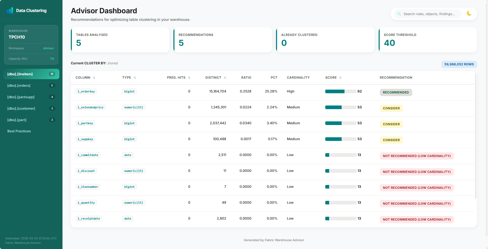
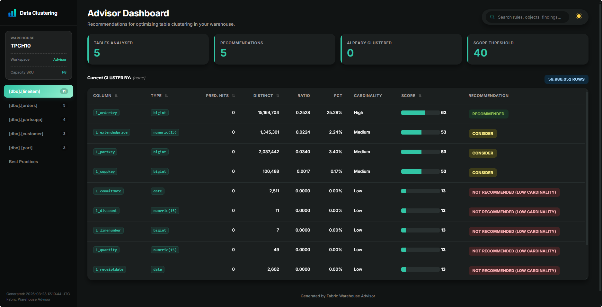
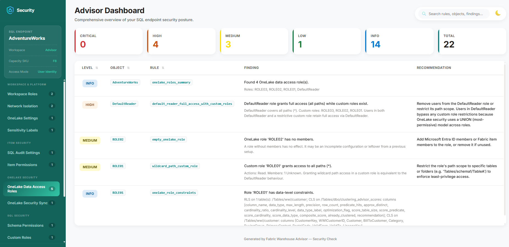
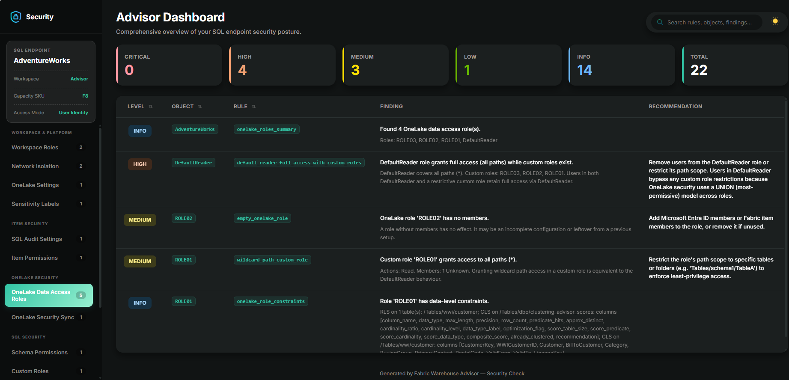
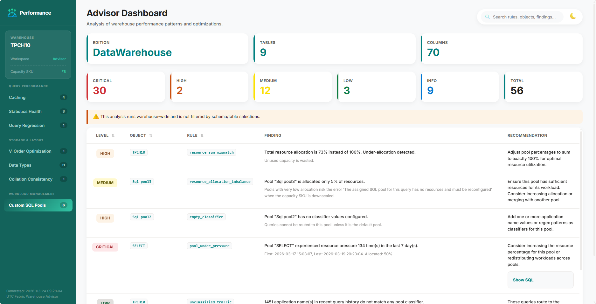
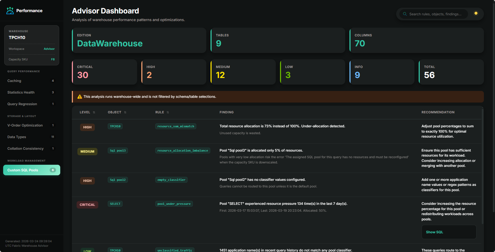

# Fabric Warehouse Advisor

[](https://pypi.org/project/fabric-warehouse-advisor/)
[](https://github.com/tiagobalabuch/fabric-warehouse-advisor/blob/master/LICENSE)

A **modular Python advisory framework** for **Microsoft Fabric Warehouse**. Each advisor module analyses a different aspect of warehouse health and produces actionable recommendations with rich reports.

Everything runs inside a **Fabric Notebook** — no external tools, no data leaves your environment.

## Available Advisors

| Advisor | What it does | Output |
|---------|-------------|--------|
| [**Data Clustering**](advisors/data-clustering/index.md) | Analyzes query patterns, table metadata, and column cardinality to identify and score the best candidate columns for data clustering, optimizing physical data organization on OneLake for better query speed. | Scored recommendations (0–100) with CTAS DDL |
| [**Performance Check**](advisors/performance-check/index.md) | Detects data-type, query regression, caching misconfigurations, V-Order status, and statistics health problems | Findings (Critical / Warning / Info) |
| [**Security Check**](advisors/security-check/index.md) | Scans for security misconfigurations and OneLake Security settings, including schema permissions, custom roles, Row-Level Security (RLS), Column-Level Security (CLS), and Dynamic Data Masking, delivering actionable insights with concrete SQL remediation guidance | Findings (Critical / High / Medium / Low / Info) |

## Quick Start

```python
from fabric_warehouse_advisor import (
    DataClusteringAdvisor, DataClusteringConfig,
    PerformanceCheckAdvisor, PerformanceCheckConfig,
    SecurityCheckAdvisor, SecurityCheckConfig,
)

# --- Data Clustering ---
dc_config = DataClusteringConfig(warehouse_name="MyWarehouse")
dc_result = DataClusteringAdvisor(spark, dc_config).run()

dc_result.save("/lakehouse/default/Files/reports/DataClusteringReport.html")
displayHTML(dc_result.html_report)

# --- Performance Check ---
pc_config = PerformanceCheckConfig(warehouse_name="MyWarehouse")
pc_result = PerformanceCheckAdvisor(spark, pc_config).run()

pc_result.save("/lakehouse/default/Files/reports/PerformanceCheckReport.html")
displayHTML(pc_result.html_report)

# --- Security Check ---
sc_config = SecurityCheckConfig(warehouse_name="MyWarehouse")
sc_result = SecurityCheckAdvisor(spark, sc_config).run()

sc_result.save("/lakehouse/default/Files/reports/SecurityCheckReport.html")
displayHTML(sc_result.html_report)
```

## Screenshots

Each advisor produces a rich, interactive HTML report with light and dark themes.

### Data Clustering

{ width="49%" }
{ width="49%" }

### Security Check

{ width="49%" }
{ width="49%" }

### Performance Check

{ width="49%" }
{ width="49%" }

  
## Why use it?

- **Data-driven decisions** — recommendations are based on your real
  workload, not rules of thumb
- **Zero setup** — Query Insights is enabled by default on every Fabric
  Warehouse; just install the library and run
- **Non-invasive** — read-only analysis via T-SQL passthrough; nothing is
  modified in your warehouse
- **Rich output** — interactive HTML reports, Markdown, plain text, and
  Spark DataFrames you can persist to Delta for tracking over time
- **Cross-workspace support** — analyse warehouses in other Fabric
  workspaces from a single notebook
- **Fully configurable** — every threshold, toggle, and weight is
  exposed as a dataclass field

## Acknowledgements

Report icons provided by [Flaticon](https://www.flaticon.com/):

- [Cyber security icons created by Freepik - Flaticon](https://www.flaticon.com/free-icons/cyber-security)
- [Performance icons created by Freepik - Flaticon](https://www.flaticon.com/free-icons/performance)
- [Graph icons created by Karacis - Flaticon](https://www.flaticon.com/free-icons/graph)
- [Idea icons created by berkahicon - Flaticon](https://www.flaticon.com/free-icons/idea)
- [Warning icons created by Hilmy Abiyyu A. - Flaticon](https://www.flaticon.com/free-icons/warning)
  
## License

MIT — see [LICENSE](https://github.com/tiagobalabuch/fabric-warehouse-advisor/blob/master/LICENSE) for details.
